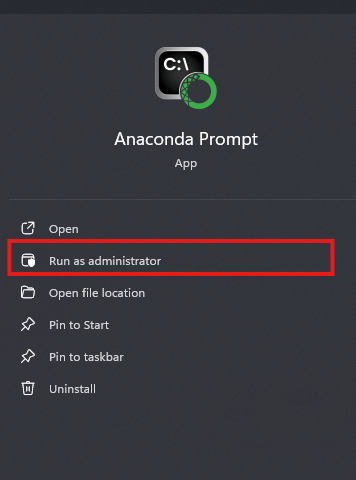

# image_classifier

This model is able to decide when a image of a person/people is given whether it shows 'sad' or 'happy' context.

This is coded and executed on a **jupyter note-book** in a windows 11 pc with an NVDIA GPU GTX 1060Ti. **Tensorflow 2.10** which is used in this project was running on **GPU mode**. For error free running we need to install tensorflow correctly. Below is a detailed explanation on how to setup **Tensorflow 2.10**.

## TensorFlow 2.10 GPU Setup Guide

### Prequesites needed:

- python 3.7-3.11 ( tensorflow 2.10 supported versions )
- cuda 11.2
- cudNN 8.1.1
- tensorRT 8.2 GA Update 1
- numpy 1.26 ( if the venv setup install a higher numpy version we need to degrage it to 1.26 )
- Microsoft Visual Studio 2019
- Microsoft Visual C++ 2015-2019

### Prequesites Setup Instructions

#### 1. python 3.7-3.11 ( tensorflow 2.10 supported versions )

- download and install latest **Ananconda Package**. When installing Ananconda it will mention that it will install a different python version than 3.7-3.11, It's totally fine. Because we will be changing through the Anaconda package itself.
- create venv in the desired location with the python version we want

```bash
    conda create --prefix ./path/to/myenv python=3.9
```

- or create the venv in the default location where all the venv are kept by anaconda

```bash
   conda create myenv python=3.9
```

#### 2. cuda 11.2

- goto https://developer.nvidia.com/cuda-11.2.2-download-archive?target_os=Windows&target_arch=x86_64&target_version=10&target_type=exelocal
- if the link is not working make sure to download the 11.2.2 version somehow.
- download settings : Operating System->Windows, Architecture->x86_64, Version->10, Installer Type->exe.
- download and install it.

#### 3. cudNN 8.1.1

- goto https://developer.nvidia.com/rdp/cudnn-archive
- select : Download cuDNN v8.1.1 (Feburary 26th, 2021), for CUDA 11.0,11.1 and 11.2
- next select : cuDNN Library for Windows (x86)
- download and extract it.
- copy everything inside the **extracted_folder\bin** folder to:

```bash
C:\Program Files\NVIDIA GPU Computing Toolkit\CUDA\v11.2\bin
```

- copy everything inside the **extracted_folder\include** folder to:

```bash
C:\Program Files\NVIDIA GPU Computing Toolkit\CUDA\v11.2\include
```

- copy everything inside the **extracted_folder\lib\x64** folder to:

```bash
C:\Program Files\NVIDIA GPU Computing Toolkit\CUDA\v11.2\lib\x64
```

- add the below three into the system path environmental variables

```bash
C:\Program Files\NVIDIA GPU Computing Toolkit\CUDA\v11.2\bin
```

```bash
C:\Program Files\NVIDIA GPU Computing Toolkit\CUDA\v11.2\bin
```

```bash
C:\Program Files\NVIDIA GPU Computing Toolkit\CUDA\v11.2\bin
```

#### 4. tensorRT 8.2 GA Update 1

- the above version can be download by free registering into NVIDIA site
- download and extract the zip.
- copy the folder TensorRT-8.2.2.1 inside, inside the myvenv folder
- it should be as **myvenv/TensorRT-8.2.2.1**
- cd into **myvenv/TensorRT-8.2.2.1/python**
- confirm of the existence of file **tensorrt-8.2.2.1-cp39-none-win_amd64.whl**
- run the following :

```bash
pip install tensorrt-8.2.2.1-cp39-none-win_amd64.whl
```

- if you install python 3.7 when creating the venv using conda. then

```bash
pip install tensorrt-8.2.2.1-cp37-none-win_amd64.whl
```

#### 5. numpy 1.26 ( if the venv setup install a higher numpy version we need to degrage it to 1.26 )

- remove incompatible version

```bash
pip uninstall numpy
```

- add the compatible version

```bash
pip uninstall numpy==1.26
```

#### 6. Microsoft Visual Studio 2019

- download Microsoft Visual Studio 2019.
- when installing, make sure to check the checkbox with **deskstop support C++** and then press install

#### 7. Microsoft Visual C++ 2015-2019

- download and install visual c++ 2015-2019 from official website

### 8. install tensorflow

- make sure to open the anaconda prompt in administrator
  

- run the following

```bash
pip install tensorflow-gpu==2.10 tensorflow==2.10
```
